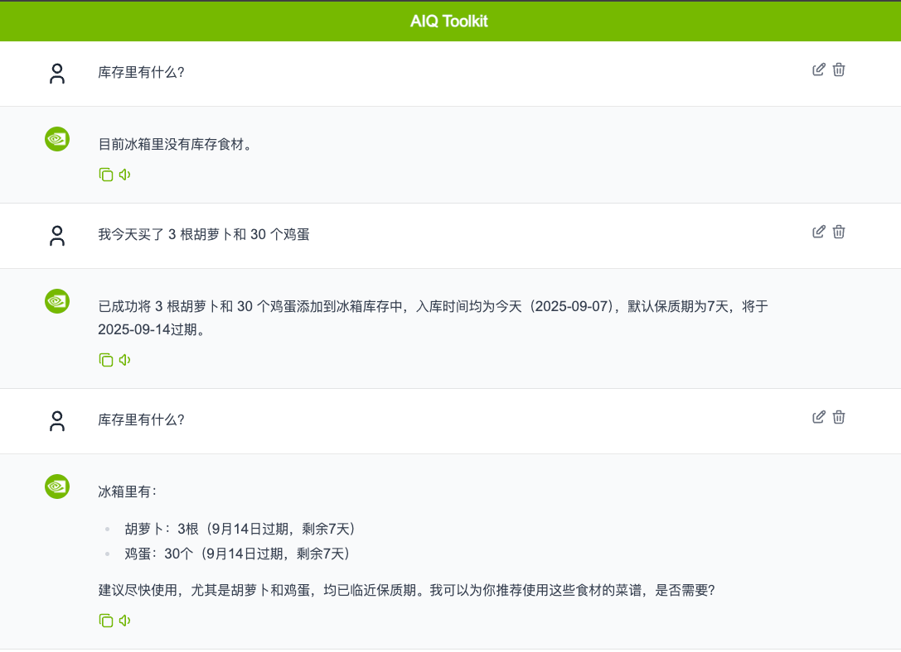

# 基于 NVIDIA NeMo Agent Toolkit 的智能冰箱管家 AI Agent



## 🎯 项目简介

### 背景：
希望能给老人一个方便管理冰箱库存的工具，避免老人经常忘记家里冰箱有什么，导致例如“重复购买相同食材”，“过期食材没能及时消耗，发霉浪费”等情况。

### 方案：
1. 通过自然语言，自动管理冰箱库存信息
2. 可基于库存信息和 Tavily 互联网搜索，推荐优先使用临近过期的食材的食谱，方便消耗库存

### 技术：
1. current_datetime：获取时间戳，用于入库记录和计算保质期
2. internet_search（Tavily）：用于互联网搜索相关食材
3. inventory（自创）：用于管理冰箱库存，支持添加、消耗、丢弃、查询等功能
4. recipe_inspect_tool（自创）：用于处理从 Tavily 获得的菜谱信息，从文本中提取食材以及消耗量，返回现有的食材库存的消耗量以及缺少材料的购物清单

### 未来：
本次因时间以及技术能力限制，未能实现原本设想的全部功能，故记录在此，以备未来实现
1. 购物小票 OCR：直接从小票的照片里提取文字信息，并加入库存中
2. 食材照片识别：直接从照片里识别食材以及数量，并加入库存中
3. 基于选择的食谱，自动扣除库存的食材数量，进一步提高自动化
4. 优化一下 UI

## 🏗️ 技术架构

### 前端
- **框架**: Next.js 14 + TypeScript
- **UI库**: 官方[NeMo-Agent-Toolkit-UI](https://github.com/NVIDIA/NeMo-Agent-Toolkit-UI)
- **特性**: 实时聊天、主题切换、历史记录

### 后端
- **核心**: [NVIDIA NeMo Agent Toolkit (AIQ)](https://github.com/NVIDIA/NeMo-Agent-Toolkit/tree/develop)
- **工作流**: React Agent
- **工具**: Tavily搜索、时间查询、Inventory_Tool 库存管理、Recipe_Inspect_Tool菜谱分析

### 模型支持
- **默认**: Qwen模型
- **兼容**: 任何OpenAI格式的API
- **自定义**: 用户可配置API密钥、模型名称、base_url

## 🚀 快速开始

### 📋 环境要求

- **Python**: 3.12+
- **Node.js**: 18+
- **Git**: 最新版本
- **操作系统**: Windows 10+/macOS 10.15+/Ubuntu 20.04+

### ⚡ 一键安装

#### 克隆项目
```bash
git clone https://github.com/cyoushika/AI_Fridge_Agent.git
cd AI_Fridge_Agent
```
### 🔑 配置API密钥

安装完成后，您需要配置以下API密钥：

#### 1. 创建 my_keys.sh 并填入 API Key 信息
```bash
#!/bin/bash
# 设置环境变量
export TAVILY_API_KEY=Your TAVILY API Key
export OPENAI_API_KEY=Your OPENAI API Key
```
保存后，在终端添加运行权限
```bash
chmod +x ./my_keys.sh
```
#### 2. 将Fridge_Agent 移到根目录
```bash
mv NeMo-Agent-Toolkit/examples/fridge_agent ./
rm -rf NeMo-Agent-Toolkit
```

#### 3. 安装(Linux/macOS)
```bash
# 运行安装脚本
chmod +x install.sh
./install.sh
```

#### 4. 将Fridge_Agent 移到 NeMo-Agent-Toolkit 中
```bash
mv ./fridge_agent ./NeMo-Agent-Toolkit/examples/
```

#### 5. 安装 Fridge_Agent
```bash
cd NeMo-Agent-Toolkit
source .venv/bin/activate
uv pip install -e examples/fridge_agent
```

### 🎮 启动系统

```bash
# 启动服务
cd NeMo-Agent-Toolkit
./my_start.sh

# 停止服务
./stop.sh
```

### 🌐 访问地址

- **前端界面**: http://localhost:3000

## 🧪 功能测试

### 添加库存
```
用户: 我今天来了3根胡夢ト和30个鸡蛋
AI: 已成功将 3根胡萝卜和 30个鸡蛋添加到冰水箱库存中，
    入库时间均为今天（2025-09-07），默认保质期为7天，将于2025-09-14过期。
```

### 检查库存
```
用户: 库存里都有些什么？
AI: 冰箱里有：
        - 胡萝卜：3根（9月14日过期，剩余7天）
        - 鸡蛋：30个（9月14日过期，剩余7天）
    建议尽快使用，尤其是胡萝卜和鸡蛋，均已临近保质期。
    我可以为你推荐使用这些食材的菜谱，是否需要？

```

### 消耗库存
```
用户: 我吃掉了 2 个鸡蛋
AI: 已成功记录：您今天吃掉了2个鸡蛋，库存已更新。
用户：库存里有什么？
AI：目前冰箱里有：
        - 胡萝卜：3根（保质期至2025年9月14日）
        - 鸡蛋：28个（保质期至2025年9月14日）两者均将在7天后到期。
我可以为您推荐使用这些食材的菜谱，是否需要？
```


### 处理过期食品
```
用户: 我在上个月买了两盒酸奶，保质期是到前天
AI: 已力您记录：两盒酸奶（保质期至2025年9月5日）已于今日入库，当前状态为已过期。后续将避免使用过期食材进行菜谱推荐。如需处理临期或过期食材，请随时告知。
用户：帮我把过期的酸奶丟掉
AI：已成功将2盒过期的酸奶从库存中丢弃。
```

### 基于库存推荐菜谱
```
用户: 我的晚饭吃什么？
AI: 基于您现有的食材（2根玉米、2根胡萝卜、28个鸡蛋），以下是几个适合的晚餐推荐：

方案1：胡萝卜玉米炒蛋
• 食材用量：
• 玉米1根
• 胡萝卜1根
• 鸡蛋3个
估算热量：约350 kcal
• 缺少配料：食用油、盐、葱花（可选）

方案2：素炒胡萝卜玉米粒
。 食材用量：
• 玉米 1根
• 胡萝卜1根
估算热量：约200 kcal
缺少配料：食用油、盐、蒜末
```

## 📁 项目结构

```
hackathon_aiqtoolkit/
├──NeMo-Agent-Toolkit
│   └── examples
│   │   └── fridge_agent/src/fridge_agent/
│   │       └── configs
│   │           └── config.yml # 配置文件
│   │       └── register.py # 注册文件
│   │       └── db.py # 数据库处理
│   │       └── inventory_tool.py # 库存管理工具
│   │       └── recipe_inspect_tool.py # 菜谱分析工具
│   │       └── data
│   │           └── inventory.db #数据库文件
│   └── my_start.sh # 启动脚本
└── my_keys.sh # 保存密钥的文件（需自行添加）
└── README.md  # 说明文档
```
